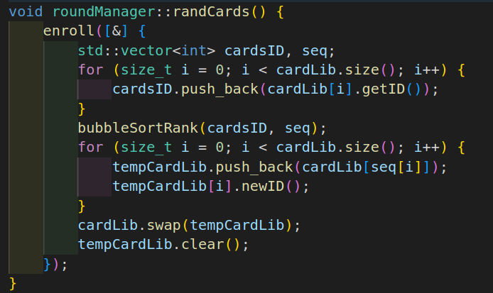
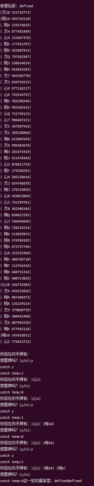

# 21点游戏

> 这项目还没写完..遇到一个bug，但洗牌是没问题的，要牌有部分问题，还没找出来
>
> 假如学长学姐有时间的话也请帮帮我解决这个bug
>
> 由于我的开发环境部署在linux上，生成.exe文件也是linux下安装msys生成的，所以环境配置详见.vscode中的四个文件
>
> （我的g++和gcc大概率是最新的，忘截图了，貌似是17）

## 洗牌函数 CBlackJack.h 103行

```c++
void roundManager::randCards() {
    enroll([&] {
        std::vector<int> cardsID, seq;
        for (size_t i = 0; i < cardLib.size(); i++) {
            cardsID.push_back(cardLib[i].getID());
        }
        bubbleSortRank(cardsID, seq);
        for (size_t i = 0; i < cardLib.size(); i++) {
            tempCardLib.push_back(cardLib[seq[i]]);
            tempCardLib[i].newID();
        }
        cardLib.swap(tempCardLib);
        tempCardLib.clear();
    });
}
```

## 洗牌函数代码截图



## 运行截图



## 思路

使用类似javascript的事件循环的思路管理游戏动作，详见eventLoop.h

生成牌管理员管理游戏，详见CBlackJack.h

# 随手记

> 这里的东西我写着写着就不管了...项目代码写完我再补，凑合着看吧

* classes
  * player:
    * args:
      * cardsInHand: vector<card>
      * point: int
      * history: vector<roundRes>
  * AIplayer:
    * base on player
    * function:
      * rule
  * roundManager:
    * args:
      * cardLib: vector<card>
      * players: vector<player>
      * rules: temples <class ruleFunction(vector<player>, vector<card>)> //在想结构的时候没料到使用模板会遇到一些问题，然后是啥问题我居然忘了！但解决方案是使用functional标准库
      * isEnd: temples <class ruleFunction(vector<player>, vector<card>)>
      * isWin: temples <class ruleFunction(vector<player>, vector<card>)>
    * function:
      * randCards
        * void
      * reqCard: player
        * args: player, cardID
      * endRound:
        * args: vector<player> as winners, vector<player> as losers
        * void
      * resCard:
        * args: player, card
      * ruleLoad:(构造)
        * args: temples <class winRule(vector<player>, vector<card>)>
        * TODO 给定何时发牌，何时结束，何时赢
* struct
  * card
    * name: string
    * cardID: string
  * roundRes
    * roundID: string
    * roundPlayer: string
    * res: bool
    * roundLabel: string