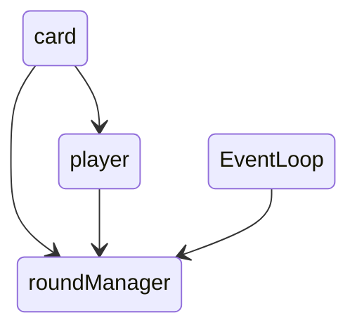
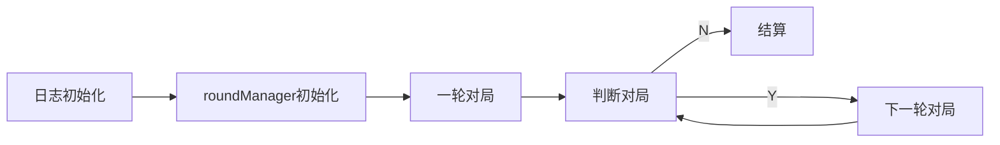
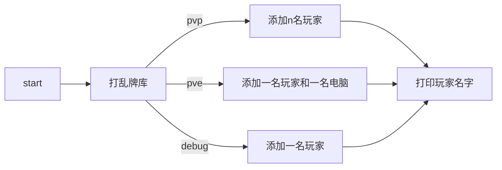

# ConsoleGame项目报告

## 课题简介

设计目标：使用C++编写21点游戏，使用控制台作为输出。面向对象编程。本文包含除洗牌文件外的问题。

## 课题分析

### 对象分析

对于本课题，我们了解到需要使用控制台制作一跨21点游戏，模拟pvp和pve功能。结合需要，我推断出有以下对象：

* card 牌对象
  
  * 牌对象，一般被放在容器中，用于管理牌的一些行为和生成
  
  * ```c++
    class card {
       private:
        /// @brief 牌名，如梅7
        std::string name;
        /// @brief 牌的唯一标识，也用于随机牌的顺序
        long cardID;
        /// @brief 牌的面值，范围在0-52，具体实现请查看构造函数
        int value;
    
       public:
        /// @brief 构建了this.name, this.cardID, this.value
        /// @param _value 传入值将作为this.value并用于构建this.name
        card(int _value);  // 牌对象的构造函数
        /// @brief 为牌新建唯一标识，且只能随机
        void newID();
        /// @return 返回cardID
        long getID();
        /// @return 返回value
        int getValue();
        /// @return 返回name
        std::string getName();
    };
    ```
  
* eventLoop 事件循环对象

  * 实现javascript的事件循环，但这个没有内存保护，不检查空指针，没有多线程，但很符合我的编程习惯

  * ```c++
    class EventLoop {
       private:
        /// @brief 函数对象容器（当然我c++的函数不是一个对象，但凑合着理解吧）
        std::vector<std::function<void()>> events;
        /// @brief 函数对象对应的解释容器
        std::vector<std::string> descriptions;
    
       public:
        /// @brief Sleep Activity Final 运行状态标识，初始状态为Sleep
        char state = 'S';
        /// @brief 构造函数，其实只提供了一个初始化接口
        EventLoop(std::function<void()> intiEvent);
        /// @brief
        /// 析构函数，也就释放事件函数数组，但说实话我不知道到底要不要释放STL容器
        ~EventLoop();
        /// @brief 如题，运行this.events[eventId]，并返回eventId+1
        int next(int eventId);
        /// @brief 向this.events添加函数对象
        void enroll(std::function<void()> event, std::string log);
        /// @brief // 如题，开始，也就遍历运行事件函数数组
        void start();
    };
    ```

* global 全局头文件

  * 保存一些重复使用的函数，作为头文件引用列表，虽然不是对象但先放在这里

  * ```c++
    #pragma once
    
    #include <chrono>
    #include <functional>
    #include <iomanip>
    #include <iostream>
    #include <random>
    #include <sstream>
    #include <string>
    #include <vector>
    
    #include "spdlog/sinks/basic_file_sink.h"
    #include "spdlog/spdlog.h"
    
    /// @brief 根据长度生成随机数
    long randNumber(int length);
    /// @brief
    /// 冒泡排序，将目标数组的下标存入另一个数组，该数组按照目标数组元素的大小从大到小重排，优点是复杂度为O(n)到O(n^2)
    /// @param arr 目标数组
    void bubbleSortRank(const std::vector<int>& _arr, std::vector<int>& res);
    /// @brief 交换两变量
    template <class T>
    void tSwap(T* p1, T* p2);
    
    ```

* player 玩家对象

  * 包括真人和电脑，对局开始时将被放入在roundManager.players容器中

  * ```c++
    class player {
       private:
        /// @brief
        /// 玩家名字，在roundManager::pvp和roundManager::pvp设置cusNam为true时会请求玩家自定义，否则系统自动填充
        std::string name = "defined";
    
       public:
        /// @brief 标记是否为机器人
        bool isBot = false;
        /// @brief 玩家手上的牌库
        std::vector<card> hand;
        /// @brief
        /// 当isBot为false时roundManager会调用该函数，该函数将通过控制台询问玩家是否要牌。
        bool mayIReqCard();
        /// @brief
        /// 当isBot为true时roundManager会调用该函数，该函数将通过point的值判断是否需要要牌。
        bool mayEReqCard(int point);
        /// @brief 访问玩家的名字
        std::string getName();
        /// @brief 向控制台和日志打印玩家牌库，打印牌的name
        std::string showCard();
        /// @brief 生成真人玩家对象
        /// @param _name 名字
        player(std::string _name);
        /// @brief 生成电脑玩家对象
        player();
    };
    ```

* roundManager 对局管理员对象

  * 管理p21游戏的所有活动

  * ```c++
    class roundManager : private EventLoop {
       private:
        /// @brief 牌库
        std::vector<card> cardLib;
        /// @brief 临时牌库，用于打乱牌库顺序
        std::vector<card> tempCardLib;
        /// @brief 加入游戏的玩家集
        std::vector<player> players;
        /// @brief debug下查看牌库
        void showCardsLib();
    
       public:
        /// @brief
        /// 回合管理员初始化，但其实只在事件循环初始化时注册了添加53张牌的函数
        roundManager();
        /// @brief 析构函数
        ~roundManager();
        /// @brief 用eventLoop.enrool注册随机牌库的函数
        void randCards();
        /// @brief debug模式下开始游戏，这时会向控制台打印牌库，并只有一个玩家参加
        void debug();
        /// @brief pvp模式下加载游戏，根据num加载玩家数量
        /// @param cusName 是否自定义玩家的名字
        void pvp(int num, bool cusName);
        /// @brief pve模式下加载游戏，一个玩家一个电脑
        /// @param cusName 是否自定义玩家的名字
        void pve(bool cusName);
        /// @brief 游戏开始时运行，添加第一次要牌任务和要牌尾调用函数
        /// @param _players 参与的玩家的数组
        void play(std::vector<player> _players);
        /// @brief 要牌尾调用函数
        void play();
        /// @brief response card 玩家得牌，牌库减牌
        /// @param playHand 对应玩家的手牌容器
        void resCard(std::vector<card> &playHand);
        /// @brief 遍历roundManager.players实现要牌操作轮询
        void resCard();
        /// @brief 计算算分函数
        /// @param playerIndex 玩家在roundManager.players中的下标
        int getPoint(int playerIndex);
        /// @brief 遍历计算分数并得出优胜者
        void getPoint();  // 计算算分函数
    };
    ```

三者关系如下：



> 以下内容与洗牌项目报告相同，但我认为有必要方在这里

当然，单单只考虑21点游戏的话，不使用面向对象的思路就可以实现，但我在学习过程中希望该项目能对现实中的牌局进行更好地复现。现实中的扑克牌不只能玩21点这个游戏，我希望我的项目同样如此。故最终，我的项目可以支持2人及以上甚至1人（不包括电脑）游戏，游戏可以使用超过一副牌，并且包含完整的日志（使用spdlog库）。以上内容仅仅包含在libp21.a（见lib）这一静态库中，之后的开发只需使用这个库即可，当然这也源于*JavaScript*的模块思想。

但可惜的是，我在构思该项目的时候始终怀念*JavaScript*中*EventLoop*[^1]（事件循环）机制，之后难以想到用其他方法实现有时。故在一开始编写了**EventLoop**，但本质上这并不是*JavaScript*的事件循环[^1]，重点在于使用c++11的Lambda表达式来控制流程，故**roundManager**就可以使用类似JavaScript的异步功能，为了让阅读更加容易，以下时**EventLoop**的简单描述：

> **EventLoop**包含一个`std::vector<std::function<void()>> events`用于存储函数，`void enroll(std::function void()  event, std::string log)`用于向`events`中添加函数，而这些函数**什么时候被执行**就由`EventLoop`的`void enroll(std::function void()  event, std::string log)`和`void start()`控制。

### 依赖

而其中关于实现日志功能，社区中已经有了大量成型的日志库，我认为使用第三方库对于软件编写人员也是一项必备的技能，以下是我尝试的具体过程。

在[《C/C++log日志库比较》](https://blog.csdn.net/gatieme/article/details/50603682)一文中了了解到了目前c++常用日志库的基本信息，在综合考虑下我选择了[spdlog](https://github.com/gabime/spdlog)。原因是这个库较为简单。

在项目中部署这个库我尝试了两种方法，最初两种都失败了，但最后都成功了...这一过程重新扩宽了我对c++编译过程的认识。

#### 源码编译

首先是spdlog仓库指导的做法

1. 下载spdlog并编译

```sh
git clone https://github.com/gabime/spdlog.git
cd spdlog && mkdir build && cd build
cmake .. && make -j
```

这里需要安装cmake，之后会在[spdlog root]/build看见以下内容

```sh
spdlog/build ❯ tree .                                                                     
.
├── CMakeCache.txt
├── cmake_install.cmake
├── CPackConfig.cmake
├── CPackSourceConfig.cmake
├── libspdlog.a
├── Makefile
├── spdlogConfig.cmake
├── spdlogConfigTargets.cmake
├── spdlogConfigVersion.cmake
└── spdlog.pc
```

这里省略了一些过于复杂的文件夹，由于本项目最终没有使用cmake，故只需将libspdlog.a添加到项目中，具体做法是

```sh
g++ main.o -0 ConsoleGame -LlibDir -lspdlog
```

这里省略了部分编译参数，但我们只需注意 -LlibDir 和 -lspdlog，前者是指定静态连接库所在文件夹，在本项目中是./lib也就是-Llib，-lspdlog代表在静态连接库目录下链接libspdlog.a。

#### vcpkg

上一种方式成功了，但假如我们需要交叉编译跨平台项目就会很麻烦，就要去读他的CmakeList.txt然后引入交叉编译工具链，这对于我这种新手是不可能的，所以更好的方法是使用[vcpkg](https://vcpkg.io/en/index.html)。windows下安装想必很容易，这里就只介绍linux下安装。

首先下载源码

```sh
git clone https://github.com/Microsoft/vcpkg.git
```

然后运行源码中的批处理文件，windows下运行.bat文件，linux下运行.sh文件

```sh
cd vcpkg
sh bootstrap-vcpkg.sh
```

等待后当前目录就会出现vcpkg的运行程序，整个目录应该是这样：


为了方便使用，我们最好创建他的软连接，我将源码放在`/usr/local/`使用时请检查安装路径：

```sh
sudo ln -s /usr/local/vcpkg/vcpkg /usr/bin/vcpkg
```

> 我在第一次尝试时源文件使用相对路径，但在运行时报错引用层数过多，网上查找一番后发现使用绝对路径就可以，但不知道为什么。

这里我们只需注意以下目录

*   packages：包编译完成后就会放在这里
*   triplets：包含基本的编译配置文件和社区提供的配置文件
*   buildtrees：编译包的build文件夹，所以日志也在这里

接下来就要下载我们需要的软件包了，但在这之前我们先看一眼triplets

```sh
/usr/local/vcpkg/triplets ❯ tree .                                                         
.
├── arm64-windows.cmake
├── arm-uwp.cmake
├── community
│   ├── arm-android.cmake
│   ├── arm-ios.cmake
│   ├── ...
│   ├── x64-android.cmake
│   ├── x64-freebsd.cmake
│   ├── x64-ios.cmake
│   ├── x64-linux-dynamic.cmake
│   ├── x64-linux-release.cmake
│   ├── x64-mingw-dynamic.cmake
│   ├── x64-mingw-static.cmake
│   └── ...
├── x64-linux.cmake
├── x64-osx.cmake
├── x64-uwp.cmake
├── x64-windows.cmake
├── x64-windows-static.cmake
└── x86-windows.cmake
```

在community是官方预设的编译选项，假如我们在linux电脑上直接使用这条命令安装

```sh
vcpkg install spdlog
```

就等同于

```sh
vcpkg install spdlog:x64-linux
```

假如我们希望在linux上用mingw编译windows程序，那么使用：

```sh
vcpkg install spdlog:x64-mingw-static
```

这样我们就避免了前文提到的，自己修改cmake工具链的问题，vcpkg已经为你编写好了。

**但是**！

相当可惜，spdlog的开发者相当敬业，spdlog是线程安全的，他们使用了mutex头文件，而linux（起码ubuntu）安装的mingw是单纯的mingw，这句话什么意思？我们先来看看/usr/bin中和x86_64-w64-mingw32有关的文件：

```sh
/usr/bin ❯ ls |grep x86_64-w64-mingw32                                                       
...
x86_64-w64-mingw32-g++
x86_64-w64-mingw32-gcc
x86_64-w64-mingw32-gcc-10-posix
x86_64-w64-mingw32-gcc-10-win32
x86_64-w64-mingw32-gcc-ar
x86_64-w64-mingw32-gcc-ar-posix
x86_64-w64-mingw32-gcc-ar-win32
x86_64-w64-mingw32-gcc-nm
x86_64-w64-mingw32-gcc-nm-posix
x86_64-w64-mingw32-gcc-nm-win32
x86_64-w64-mingw32-gcc-posix
x86_64-w64-mingw32-gcc-ranlib
x86_64-w64-mingw32-gcc-ranlib-posix
x86_64-w64-mingw32-gcc-ranlib-win32
x86_64-w64-mingw32-gcc-win32
x86_64-w64-mingw32-g++-posix
x86_64-w64-mingw32-g++-win32
x86_64-w64-mingw32-ld
x86_64-w64-mingw32-ld.bfd
...
```

而之前说的单纯的mingw就是x86_64-w64-mingw32-gcc(g++)，假如在windows下安装mingw在安装引导程序时就会设置这些参数，而linux则是通过使用不同的程序来启用这些设置。

之前我们提到vcpkg的buildtrees目录，原因就是vcpkg直接编译mingw时会抛出一堆错误，而cmake并不会直接说错误是什么，只会干巴巴地抛出依据build failed！所以我只好自己区看日志。经过一番搜索后终于检查到是编译器的问题。使用mutex的程序需要poxie的mingw。

可惜我搞不懂cmake的交叉编译到底是个什么玩意，所以只能用一些粗暴的办法

```sh
cd /usr/bin
sudo mv x86_64-w64-mingw32-g++ x86_64-w64-mingw32-g++.bak # 备份
sudo cp x86_64-w64-mingw32-g++-posix x86_64-w64-mingw32-g++
```

>   技术不好就只能整这点活了

现在，我们就得到了完整的spdlog，并且，vcpkg作为c++包管理程序会根据依赖自动补奇所需的程序，由于spdlog团队的敬业精神，spdlog是支持c++11的，所以他们使用了fmt作为依赖让程序可以使用c++20的文本格式化程序。我们先来看看vcpkg的packages：


在开发环境下，我们只需要linux版本的库，所以我们只需关注带_x64-linux的文件夹，现在使用如下命令拷贝我们所需的文件：

```sh
cp -r ./fmt_x64-linux/lib [项目根目录]/lib
cp -r ./fmt_x64-linux/lib [项目根目录]/include
cp -r ./spdlog_x64-linux/lib [项目根目录]/lib
cp -r ./spdlog_x64-linux/lib [项目根目录]/include
```

在开始编译.o文件时加上`-Iinclude`，这样编译器就能识别spdlog

在最后链接时加上`-Llib -lfmt -lspdlog`，这样编译器就生成带静态连接库的程序

这样，我们就能使用spdlog啦～

这是本项目的部分路径，


## 设计思路

好的产品有着清晰明了的生命周期，本项目也是如此：



下面我将一一说明每个阶段的具体内容。

### 日志初始化

在前文介绍了如何安装spdlog，现在介绍如何在代码中使用。spdlog有两种版本，一种只需引入头文件，一种引入头文件和静态库，本项目使用另一种，这也是spdlog仓库推荐的做法。在前文已经介绍了如何提取静态库和对应的头文件，而本项目对于日志只有两个要求：输出到文件和格式化，那么我们就需要在项目顶级头文件global.h中添加文件。

```c++
#include "spdlog/sinks/basic_file_sink.h"
#include "spdlog/spdlog.h"
```

第一个是引入基础文件加载，第二个是引入基础功能。剩下的就是代码./main.cpp

```c++
auto file_logger = spdlog::basic_logger_st("basic_logger", "./logs/p21_" + str_time + ".log");
spdlog::set_default_logger(file_logger);
spdlog::set_pattern("[%Y-%m-%d %H:%M:%S.%e][%l]: %v");
spdlog::info("game start!");
```

首先是创建日志记录，basic_logger_st，st代表single threat。这里的str_time是前文定义的字符串型日期，这是代码：

```c++
// 获取系统时间
auto t = std::chrono::system_clock::to_time_t(std::chrono::system_clock::now());
// 转为字符串
std::stringstream ss;
ss << std::put_time(std::localtime(&t), "%Y-%m-%d-%H-%M-%S");
std::string str_time = ss.str();
```

需要引入以下头文件：

```c++
#include <sstream>
#include <iomanip>
#include <chrono>
```

现在，我们就可以将后续的日志放在同目录下的logs文件夹中，以程序打开时间为文件名。

### roundManager初始化和一轮对局

roundManager的初始化有这几步：

1.   向牌库中添加牌`src/roundManager.cpp`

```c++
roundManager::roundManager()
    : EventLoop([&]() -> void {
          // init cardLib
          for (size_t i = 0; i < 53; i++) cardLib.push_back(card(i));
      }) {}
```

这里是在roundManager的构造函数中调用EventLoop的构造函数，EventLoop的构造函数如下：

```c++
EventLoop::EventLoop(std::function<void()> intiEvent) {
    events.push_back(intiEvent);
    descriptions.push_back("事件循环初始化");
}
```

这里代码很简单，就不多赘述了。

2.   调用游戏模式对应的函数

在include/roundManager.h中如下函数对应着以不同模式开始游戏，细节见注释

```c++
/// @brief debug模式下开始游戏，这时会向控制台打印牌库，并只有一个玩家参加
void debug();
/// @brief pvp模式下加载游戏，根据num加载玩家数量
/// @param cusName 是否自定义玩家的名字
void pvp(int num, bool cusName);
/// @brief pve模式下加载游戏，一个玩家一个电脑
/// @param cusName 是否自定义玩家的名字
void pve(bool cusName);
```

而具体流程见下图：



代码只关注pvp模式

```c++
void roundManager::pvp(int num, bool cusName) {
    randCards();
    std::vector<player> as;
    for (int i = 0; i < num; i++) {
        std::string name = "";
        if (cusName) {
            printf("请输入第%d位玩家的名字:", i + 1);
            getline(std::cin, name);
        } else {
            name = "自动编号(" + std::to_string(i + 1) + ")";
        }
        spdlog::info("玩家 {}初始化", name);
        player a(name);
        as.push_back(a);
    }
    spdlog::info("玩家初始化结束, 载入{}位玩家", num);
    play(as);
}
```

在函数的末尾，调用了`void roundManager::play(std::vector<player> _players)`函数，这里主要向控制台打印玩家列表和注册第一轮对局，在函数末尾，调用`void EventLoop::start()`函数，游戏就正式开始了：

```c++
void roundManager::play(std::vector<player> _players) {
    // 加载玩家
    players.swap(_players);
    // 打印玩家列表
    printf("\n参赛玩家：");
    for (size_t i = 0; i < players.size(); i++)
        printf("%s ", players[i].getName().c_str());
    printf("\n");
    // 注册第一轮要牌
    enroll(
        [&]() -> void {
            for (size_t i = 0; i < players.size(); i++)
                for (int ii = 0; ii < 3; ii++) resCard(players[i].hand);
            turnsNum = 4;
            resCard();
            play();
        },
        "1轮要牌，强制给牌");
    start();
}
```

### 判断对局

第一轮对局和之后的对局有不同，这里会遍历玩家容器，向每位玩家的牌库添加三张牌，在函数末尾调用判断对局的函数`void roundManager::play()`，只是单纯判断什么时候结算。

```c++
void roundManager::play() {
    if (turnsNum <= 5) {
        enroll(
            [&]() -> void {
                turnsNum++;
                resCard();
                play();
            },
            std::to_string(turnsNum + 1) + "轮要牌");
    } else {
        enroll([&]() -> void { getPoint(); }, "计算点数");
    }
}
```

### 下一轮对局

普通要牌的过程写在`void roundManager::play()`里，主要是这个要牌的过程，也就是`void roundManager::resCard()`。

```c++
void roundManager::resCard() {
    for (size_t i = 0; i < players.size(); i++) {
        printf("%s", players[i].showCard().c_str());
        // 判断是否为玩家
        if (players[i].isBot ? players[i].mayEReqCard(getPoint(i))
                             : players[i].mayIReqCard())
            resCard(players[i].hand);
    }
}
```

这里主要是向控制台打印玩家的牌，并且判断玩家是否为电脑，是电脑就执行`bool player::mayEReqCard(int point)`，是玩家就执行`bool player::mayIReqCard()`，假如返回true就调用给牌函数`void roundManager::resCard(std::vector<card> &playerHand)`。

```c++
void roundManager::resCard(std::vector<card> &playerHand) {
    playerHand.push_back(*cardLib.rbegin());
    cardLib.pop_back();
}
```

### 结算

这算是写的比较臃肿的了，首先是`void roundManager::getPoint()`遍历玩家计算每位玩家的分数，然后再计算谁是赢家。

```c++
void roundManager::getPoint() {
    std::vector<int> winner;
    int winnerPoint = 0, tempPoint = 21;
    bool winnerType = false;  // 用false表示超过21分，用true表示没超过21分
    spdlog::info("对局结束，计算分数");
    for (size_t i = 0; i < players.size(); i++) {
        tempPoint = getPoint(i);
        if (!i) winnerPoint = tempPoint;
        if (tempPoint <= 21) {
            if (winnerType) {
                if (winnerPoint < tempPoint) {
                    winnerPoint = tempPoint;
                    // 清除平局情况
                    std::vector<int>().swap(winner);
                    winner.push_back(i);
                } else if (winnerPoint == tempPoint) {
                    // 平局情况
                    winner.push_back(i);
                }
            } else {
                winnerPoint = tempPoint;
                // 清除平局情况
                std::vector<int>().swap(winner);
                winner.push_back(i);
            }
            winnerType = true;
        } else {
            if (winnerType)
                continue;
            else {
                if (winnerPoint > tempPoint) {
                    winnerPoint = tempPoint;
                    // 清除平局情况
                    std::vector<int>().swap(winner);
                    winner.push_back(i);
                } else if (winnerPoint == tempPoint) {
                    // 平局情况
                    winner.push_back(i);
                }
            }
        }
    }
    printf("这一轮的赢家是：");
    for (size_t i = 0; i < winner.size(); i++) {
        printf("[%s]", players[winner[i]].getName().c_str());
        spdlog::info("算分阶段: 胜者为|{}|", players[winner[i]].getName());
    }
    printf("\n");
}
```

`int roundManager::getPoint(int playerIndex)`函数根据玩家在roundManager.players中的下标计算得分，这一函数也被用在电脑玩家判断是否要牌。

```c++
int roundManager::getPoint(int playerIndex) {
    int res = 0;
    bool A = false;
    for (size_t i = 0; i < players[playerIndex].hand.size(); i++) {
        if ((players[playerIndex].hand[i].getValue() % 13) != 0) {
            spdlog::info("算牌阶段: 计算牌|{}| |{}| res|{}|",
                         players[playerIndex].hand[i].getName(),
                         players[playerIndex].hand[i].getValue(), res);
            res += (players[playerIndex].hand[i].getValue() % 13) + 1;
        } else {
            // 记录玩家是否持有A
            A = true;
            res += 1;
        }
    }
    if (A) {
        // 玩家手中有A时,判断对玩家有利的情况
        if (res <= 10) {
            res += 11;
        }
    }
    players[playerIndex].showCard();
    spdlog::info("算分阶段: 玩家|{}|的得分为|{}|",
                 players[playerIndex].getName(), res);
    return res;
}
```

至此，就是本项目大部分的内容。

## 实现结果


## 课设总结

该问题让我感受到了完整c++项目的复杂性，我认为可以在以下几点作出改进：

1. 在`bubbleSortRank`中使用冒泡排序，但使用插入排序会更快。
2. 可以添加在任何模式下将牌库写入日志的函数。
3. 是否需要为排序后的牌重新赋予ID有待商榷。
4. 未在windows平台测试。

## 附录

源代码已上传Github：https://github.com/nan-mu/ConsoleGame.git

本文的md版本位于Github中的doc文件夹，欢迎阅读markdown版本。

[^1]:https://juejin.cn/post/6962806212660297758
