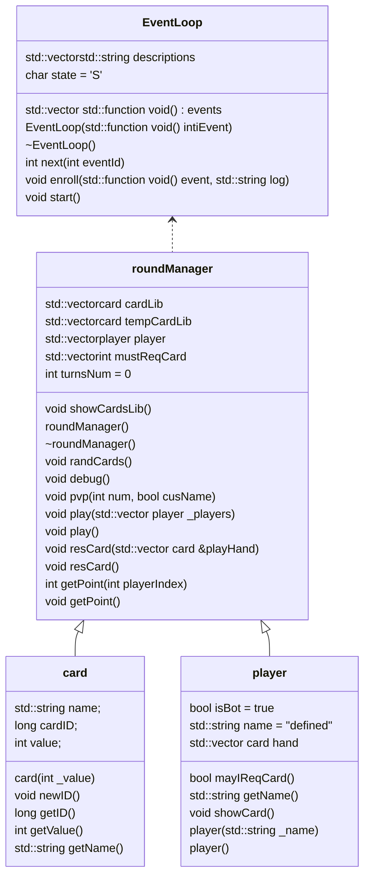

# BlackJack洗牌的实现

## 课题简介

设计目标：使用C++编写21点游戏，使用控制台作为输出。面向对象编程。本文主要针对洗牌问题。

## 课题分析

对于洗牌，首先得知存在两个对象：洗牌执行对象、被洗的牌。故程序首先应构建这里个类。在本项目中分别为**roundManager**(对局管理员)和**card**(牌)。结合21点游戏的其他需要，完整的项目有以下关系：（由于本报告只与洗牌问题相关，所以只需注意**roundManager**和**card**即可）

而最关键的洗牌相关的函数是`void roundManager::randCards()` 被洗的牌被存放在`std::vector<card> cardLib`中，`std::vector<card> tempCardLib`用于在洗牌过程中临时存放牌。

当然，单单只考虑21点游戏的话，不使用面向对象的思路就可以实现，但我在学习过程中希望该项目能对现实中的牌局进行更好地复现。现实中的扑克牌不只能玩21点这个游戏，我希望我的项目同样如此。故最终，我的项目可以支持2人及以上甚至1人（无ai）游戏，游戏可以使用超过一副牌，并且包含完整的日志（使用spdlog库）。

但可惜的是，我在构思该项目的时候始终怀念*JavaScript*中*EventLoop*[^1]（事件循环）机制。故在一开始编写了**EventLoop**，而**roundManager**就可以使用类似JavaScript的异步功能，由于本文只关注洗牌问题，为了让阅读更加容易，以下时**EventLoop**的简单描述：

> **EventLoop**包含一个`std::vector<std::function<void()>> events`用于存储函数，`void enroll(std::function void()  event, std::string log)`用于向`events`中添加函数，而这些函数**什么时候被执行**就由`EventLoop`的`void enroll(std::function void()  event, std::string log)`和`void start()`控制。

## 设计思路

在模拟真实牌局中，我注意到一场牌类游戏可能用到多副牌，所以**card**的构造函数中我为牌对象生成了9位的ID，该ID随机生成，故我们可以将一副牌按照ID大小排序存放在**std::vector<card> cardLib**，并在以后**roundManager**给**player**发牌的时候按照从尾到首的顺序向，这就实现了洗牌的功能。其中涉及到以下函数：

* card::card(int _value) - **card**的构造函数 - src/card.cpp
  * 
  * 这里做两件事，一是根据_value的值生成对应的牌面，存放在`card::name`中，二是调用`randNumber`为牌生成ID，存放在`card::cardID`中。
* long randNumber(int length) - 根据长度生成随机数 - src/global.cpp
  * 
  * 这是该函数使用的全局变量 - src/global.cpp
    * 
    * 这里使用c++标准库random。
  * 该函数使用随机数字字符拼成字符串，再将该字符串转换位`long`类型的数字返回。
* void bubbleSortRank(const std::vector<int>& _arr, std::vector<int>& res) - 冒泡排序下标 - src/global.cpp
  * 
  * 按照传统冒泡排序的思路，但在开始前生成一个0到`_arr.size()`的数组`res`，交换变量时同时交换`res`的值，这样在结束时就能得到一个下标排序数组，该数组的第一个元素的值是被排序数组中最大元素的下标，第二个元素是被排序数组中最大元素的下标，依次类推。

* void roundManager::randCards() - src/roundManager.cpp
  * 
  * 该函数首先将牌库中的牌的ID放入一个数组中，再使用`bubbleSortRank`函数获得排序下标，之后按照排序下标为`cardLib`牌库重新排序就可以了（但未给ID重排）。

## 实现结果

> 在调试模式下会输出牌库内容。

由该图我们可以看到，洗牌成功。

## 课设总结

该问题让我感受到了完整c++项目的复杂性，我认为可以在以下几点作出改进：

1. 在`bubbleSortRank`中使用冒泡排序，但使用插入排序会更快。
2. 可以添加在任何模式下将牌库写入日志的函数。
3. 是否需要为排序后的牌重新赋予ID有待商榷。

## 附录

源代码已上传Github：

[^1]:https://juejin.cn/post/6962806212660297758
